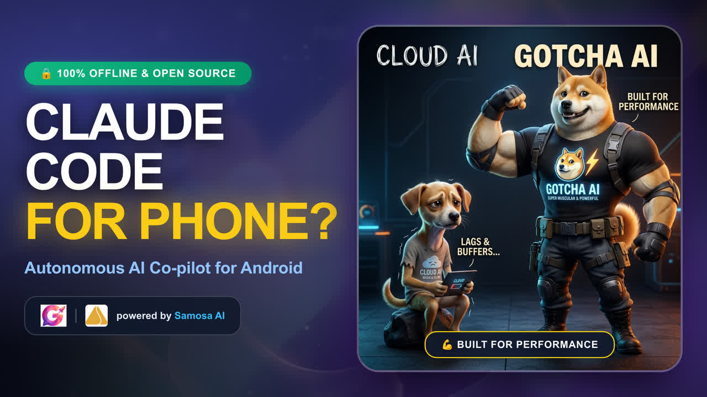

<div align="center">

# 📱 Gotcha

### Say it. Gotcha does it.

**The world's first open-source AI copilot for Android — fully on-device, turning natural language into real device actions.**

[](https://samosa-ai.com/gotcha)
[](https://samosa-ai.com/gotcha/docs)
[](https://discord.com/invite/rsgXSpcWNq)
[](https://github.com/samosa-ai-com/Gotcha/releases/latest)
[](LICENSE)

`Android 11+` · `Bring your own model` · `No PC, no server, no ADB tether`

</div>

---

Most AI assistants talk — **Gotcha acts**. 🤖

Say *"text mom I'm running late"*, *"free up some space"*, or *"what's on my screen?"*. An LLM reads your request plus live device context, picks from **100+ purpose-built Android tools**, executes real actions, and reports back — by text or by voice. 🗣️

Everything runs in **one self-contained app on your phone**. Bring your own API key (OpenAI, OpenRouter, Groq, or a local llama.cpp / LM Studio / Ollama server) — it's encrypted on-device and never synced — or sign in to Samosa AI and skip the key entirely. 🔑

<div align="center">

<a href="https://www.youtube.com/watch?v=Zk5-dtqRB64">
  
</a>

**🎬 [Setting up Gotcha on your phone — step by step](https://www.youtube.com/watch?v=Zk5-dtqRB64)**

</div>

## 🏁 Getting Started

Grab the latest `.apk` from [**GitHub Releases**](https://github.com/samosa-ai-com/Gotcha/releases/latest), then follow the **[Getting Started Guide](https://samosa-ai.com/gotcha/docs/getting-started)** — or watch the [**video walkthrough**](https://www.youtube.com/watch?v=Zk5-dtqRB64) above. 🛠️

Building from source instead? 👇

```bash
./gradlew installDebug
```

The app opens on Settings — fill in **API key**, **Base URL** (including `/v1/`), and **Model name**, grant the prompted permissions, and you're live. Full setup notes live in [`RUNNING.md`](docs/RUNNING.md).

## 🌟 Highlights

* **🧰 100+ device-control tools** — calls, SMS, contacts, calendar, alarms, files, terminal, location, apps, clipboard, camera, screen automation, notifications, device admin, and root. → [Tool Catalog](https://samosa-ai.com/gotcha/docs/tool-catalog)
* **🎭 Two copilot modes** — read-only **Monitor** (*inspect & plan*, 30 tools) and full-access **Operator** (*execute & automate*). Switch any time, even mid-conversation. → [Copilot Modes](https://samosa-ai.com/gotcha/docs/agent-modes)
* **🔮 The Assistive Ball** — a floating bubble that rides over every app, hosting push-to-talk voice calls with the full copilot. → [Assistive Ball](https://samosa-ai.com/gotcha/docs/assistive-ball)
* **🔍 Screen Lens & Companion** — circle anything on screen to copy, translate, or ask about it; get one-tap offers when an address, price, or date appears. Text extraction runs on-device.
* **🛡️ Safety by design** — capability tiers, up-front permissions, a hard confirmation gate on sensitive actions, a command deny-list, and an append-only audit log. → [Safety & Permissions](https://samosa-ai.com/gotcha/docs/safety-permissions)
* **🏠 Local & cloud AI** — any OpenAI-compatible `/chat/completions` endpoint with tool calling, or Samosa AI for free starter credits.
* **⚡ Skills** — bundled operational guidance for specific apps, injected automatically when that app is in front. → [Skill Hub](https://samosa-ai.com/gotcha/hub)
* **🎙️ Voice & vision** — selectable TTS/STT providers, plus screenshot understanding for multimodal models.

## 📚 Documentation

* 🚀 [**Getting Started**](https://samosa-ai.com/gotcha/docs/getting-started) — install, configure a model, grant permissions.
* 🎭 [**Copilot Modes**](https://samosa-ai.com/gotcha/docs/agent-modes) — Monitor vs Operator, and what each can touch.
* 🧰 [**Tool Catalog**](https://samosa-ai.com/gotcha/docs/tool-catalog) — every tool, grouped by capability.
* 🏗️ [**Architecture**](https://samosa-ai.com/gotcha/docs/architecture) — how the copilot loop, tools, and services fit together.
* 🛡️ [**Safety & Permissions**](https://samosa-ai.com/gotcha/docs/safety-permissions) — capability tiers, confirmation gates, audit log.
* ❓ [**FAQ & Known Limitations**](https://samosa-ai.com/gotcha/docs/faq) — backend compatibility and rough edges.
* ✅ [**Feature Test Coverage**](docs/FEATURE_TEST_COVERAGE.md) — every tool and how it's verified.

## 🤝 Project & Community

* 💬 [**Discord**](https://discord.com/invite/rsgXSpcWNq) — chat with the team and other users, share skills, and get help in real time.
* 🗣️ [**GitHub Discussions**](https://github.com/orgs/samosa-ai-com/discussions) — feature ideas, Q&A, and longer-form conversations that outlive a chat message.
* 💡 [**Contributing**](CONTRIBUTING.md) — branching strategy, how to add a tool, and the checks to run before a PR:
  ```bash
  ./gradlew testDebugUnitTest    # JVM unit tests (needs a POSIX sh)
  ./gradlew detekt lintDebug     # static analysis — no baselines, everything must pass
  ```
* 🛡️ [**Security Policy**](SECURITY.md) — how we handle vulnerabilities and where to report them privately.
* ⚖️ [**License**](LICENSE) — released under AGPL-3.0. Copyright © 2026 Samosa AI.

> [!WARNING]
> **Use Gotcha responsibly and at your own risk.** It is driven by LLMs acting autonomously across powerful Android APIs. Models can hallucinate, misread instructions, or fire unexpected tool calls — which can mean data loss or unwanted configuration changes. Start in **Monitor** mode, prefer a spare device or emulator while evaluating, grant permissions carefully, and keep backups. We assume no liability for any loss or damage incurred through use of Gotcha.
